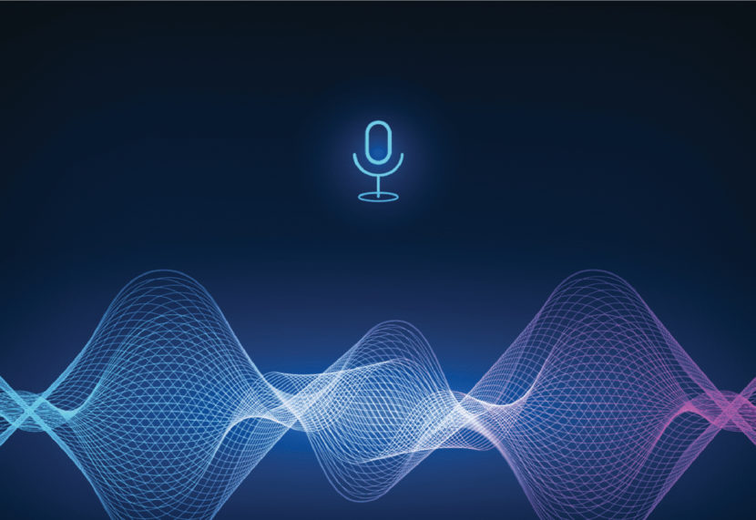

# Audio-Recognition-Using-NLP

My NLP & Deep Learning project.

Audio Recognition using NLP & Deep Learning.

A brief about the notebook:

1- Downloading & Importing Data

2- Reading & Preparing Data

3- Data Analysis & Understanding

4- Data Pre-Processing

5- Building the Model

6- Model Evaluation

7- Testing the performance of the model

